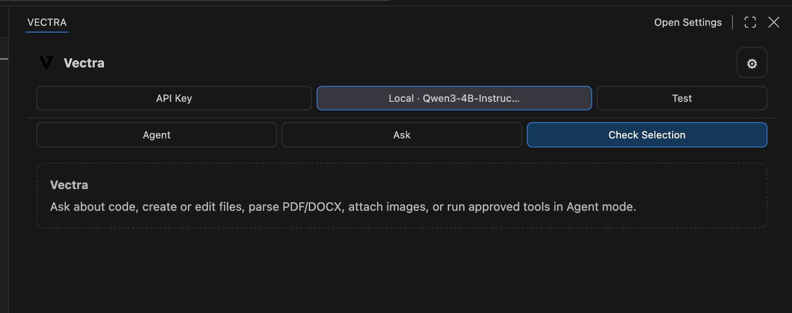

<p align="center">
  
</p>

<h1 align="center">Vectra</h1>

<p align="center">
  <a href="./vectra-extension"></a>
  <a href="https://github.com/ggml-org/llama.cpp"></a>
  <a href="./vectra-extension/CHANGELOG.md"></a>
  <a href="./LICENSE"></a>
</p>

Vectra is a local-first AI coding agent for VS Code and the web. It understands your workspace, helps create and review changes, works with documents, and can run approved tools—without forcing every conversation through a paid cloud model.

> The VS Code extension is published on the Marketplace as **Vectra AI** (`laudarisd.vectra-ai`) — an upgraded, continued release of the original Vectra agent, now under a new Marketplace listing.

Download a GGUF model once, load it through llama.cpp, and run your coding agent locally. Your model and prompts remain on your machine, and you avoid recurring API-token costs.



## Packages

| Package | Description | Documentation |
| --- | --- | --- |
| Vectra for VS Code (published as Vectra AI) | Repository-aware coding agent with local GGUF and optional cloud models | [Extension guide](vectra-extension/README.md) |
| Vectra Web | Browser-based local AI chat with file and document support | [Web guide](vectra-web/README.md) |

## Requirements

- macOS, Windows, or Linux
- [llama.cpp](https://github.com/ggml-org/llama.cpp) installed, with `llama-server` on your `PATH` — only needed to run a local model
- A downloaded instruction-tuned `.gguf` model. A quantized 3B–4B model is a practical starting point; larger models need more RAM/VRAM
- VS Code 1.90+ (extension) or Node.js 22.13+ (web)
- Optional: an API key for OpenAI, Anthropic, Gemini, or an OpenAI-compatible endpoint if you'd rather use a cloud model instead of a local one

## Highlights

- Run local `.gguf` models through llama.cpp and reduce API-token costs.
- Explore repositories, read files, search code, and inspect diagnostics.
- Delegate to a specialized agent team — planner, researcher, coder, tester, reviewer, security, and documentation — each limited to only the tools its role needs, with live grouped progress in the chat.
- Preview workspace changes before applying them.
- Run files, projects, tests, and commands only after approval.
- Read PDF, DOCX, PPTX, XLSX, RTF, code, text, and image attachments.
- Optionally connect OpenAI, Anthropic, Gemini, Ollama, or compatible APIs.

## Get started

Open the guide for the package you want:

- **VS Code**: install [llama.cpp](https://github.com/ggml-org/llama.cpp), open Vectra's sidebar, and select **Local Model** to load a `.gguf` file. Full steps in the [extension guide](vectra-extension/README.md#quick-start).
- **Web**: `cd vectra-web && npm start`, then choose **Local llama.cpp** in the browser UI. Full steps in the [web guide](vectra-web/README.md#quick-start).

## Development

```bash
cd vectra-extension
npm install
npm run check
npm test
```

Press `F5` in VS Code to open an Extension Development Host. See the package READMEs for extension and web setup details.

The extension and web app each own their agent core independently — see [`vectra-extension/ARCHITECTURE.md`](vectra-extension/ARCHITECTURE.md) and [`vectra-extension/CODE_STRUCTURE.md`](vectra-extension/CODE_STRUCTURE.md) for how the two products relate, and [`TASKS.md`](TASKS.md) for the active roadmap.

## Author and license

Created by [Sudip Laudari](https://github.com/Laudarisd). Source and support: [github.com/Laudarisd/vectra](https://github.com/Laudarisd/vectra).

Vectra is proprietary software. See [LICENSE](LICENSE) for permitted use.
